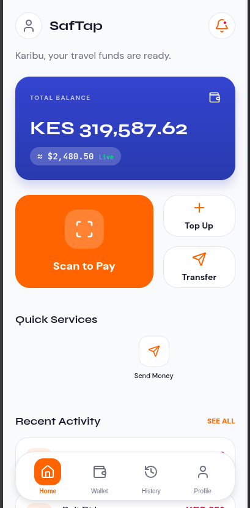

# SafTap 

SafTap is a high-fidelity DeFi payment bridge that enables anyone to seamlessly convert and spend digital assets in the real world through instant USDC-to-M-PESA settlements. Whether you're a tourist, freelancer, remote worker, crypto-native user, or merchant, SafTap bridges blockchain and local payments with a secure, intuitive Neo-Fintech experience.

---

### User Interface
Below is a preview of the SafTap application interface, demonstrating the primary workspace:

##  Key Features

* **Instant Settlements:** Convert USDC directly to your local M-PESA mobile wallet in seconds.
* **Multi-Persona Support:** Tailored experiences for tourists, remote workers, freelancers, and local merchants.
* **DeFi-to-Fiat Bridge:** High-fidelity, non-custodial pipelines ensuring security and competitive rates.
* **Intuitive Neo-Fintech UX:** Simplified onboarding that abstracts complex blockchain transactions under a clean interface.

##  Security & Architecture

SafTap uses non-custodial contract mechanics to ensure your digital assets remain secure throughout the settlement lifecycle. All currency swaps and API transfers deploy industry-standard encryption protocols.

##  Contributing

Contributions make the open-source community an amazing place to learn, inspire, and create. 

1. Fork the Project
2. Create your Feature Branch (`git checkout -b feature/AmazingFeature`)
3. Commit your Changes (`git commit -m 'Add some AmazingFeature'`)
4. Push to the Branch (`git push origin feature/AmazingFeature`)
5. Open a Pull Request

##  License

Distributed under the MIT License. See `LICENSE` for more information.
